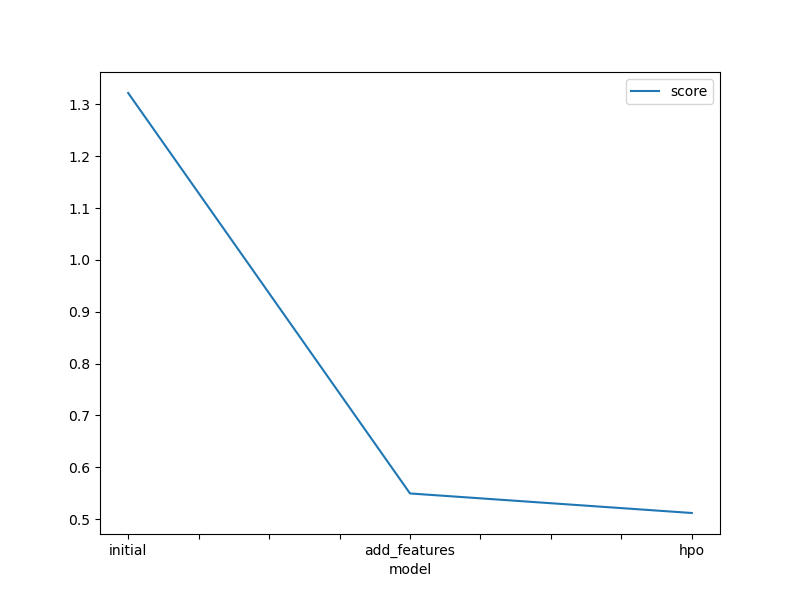
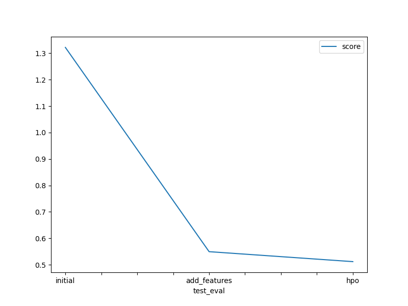

# Bike Sharing Demand Prediction with AutoGluon

This repository contains my project for the **AWS Machine Learning Fundamentals Nanodegree Program**.

The goal of this project is to predict hourly bike rental demand using the Kaggle **Bike Sharing Demand** dataset. I used Python, Pandas, Matplotlib, and AutoGluon to build, improve, and evaluate machine learning models.

## Project Overview

This project follows an end-to-end machine learning workflow:

- Download the Bike Sharing Demand dataset from Kaggle
- Load the training, test, and sample submission files with Pandas
- Explore the dataset with summary statistics and visualizations
- Create new features from the `datetime` column
- Convert categorical numeric columns to category data types
- Train regression models with AutoGluon `TabularPredictor`
- Make predictions on the test dataset
- Submit prediction files to Kaggle
- Compare model performance across multiple iterations

## Repository Structure

```text
bike-sharing-demand-autogluon/
│
├── README.md
├── requirements.txt
├── .gitignore
├── project_notebook.ipynb
├── project_notebook.html
├── project_report.md
│
├── data/
│   ├── train.csv
│   ├── test.csv
│   └── sampleSubmission.csv
│
├── img/
│   ├── model_train_score.png
│   └── model_test_score.png
│
└── submissions/
    ├── submission.csv
    ├── submission_new_features.csv
    └── submission_new_hpo.csv
```

## Dataset

The dataset comes from the Kaggle **Bike Sharing Demand** competition.

The main files are:

- `train.csv` - training data with the target variable
- `test.csv` - test data used for Kaggle predictions
- `sampleSubmission.csv` - sample Kaggle submission format

The target column is:

```text
count
```

This represents the total number of bike rentals for a given hour.

## Feature Engineering

The original dataset includes a `datetime` column. I created new time-based features from this column, such as:

- hour
- day
- month
- year

These features helped the model better capture bike demand patterns by time of day and season.

I also converted columns such as `season`, `holiday`, `workingday`, and `weather` into categorical data types because they represent groups rather than continuous numeric values.

## Model Training

I used AutoGluon `TabularPredictor` to train regression models.

Example:

```python
from autogluon.tabular import TabularPredictor

predictor = TabularPredictor(
    label="count",
    eval_metric="root_mean_squared_error"
).fit(train_data=train)
```

## Model Results

Three model iterations were tested:

| Model Iteration | Description | Kaggle Score |
|---|---|---:|
| Initial | Baseline AutoGluon model | 1.32199 |
| Add Features | Added datetime-based features | 0.54955 |
| HPO | Hyperparameter tuning | 0.51185 |

Lower Kaggle scores are better.

The largest improvement came from adding time-based features. The score improved from **1.32199** to **0.54955** after feature engineering. Hyperparameter tuning improved the score further to **0.51185**.

## Visualizations

### Model Training Score



### Kaggle Test Score



## How to Run This Project

Install the required packages:

```bash
pip install -r requirements.txt
```

Open the notebook:

```bash
jupyter notebook project_notebook.ipynb
```

Then run the notebook cells in order.

## Requirements

Main libraries used:

- pandas
- numpy
- matplotlib
- autogluon
- kaggle
- jupyter

## Important Security Note

Do **not** upload your Kaggle API token to GitHub.

Do not commit:

```text
kaggle.json
.kaggle/
```

These files should be excluded with `.gitignore`.

## Summary

This project demonstrates how AutoGluon can be used for a regression problem. Feature engineering had the biggest impact on model performance, and hyperparameter tuning provided an additional improvement. The final model achieved the best Kaggle score among the tested iterations.
